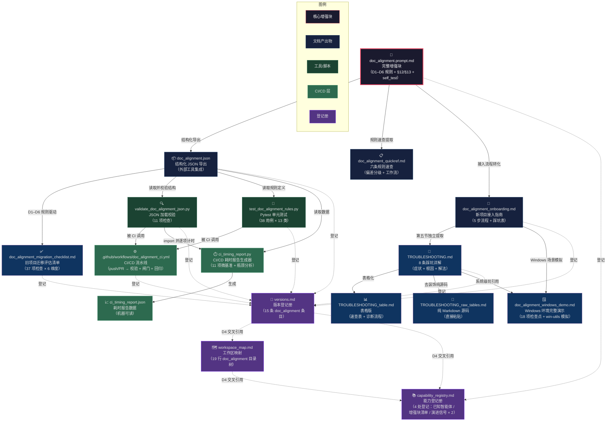
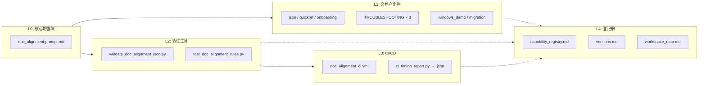
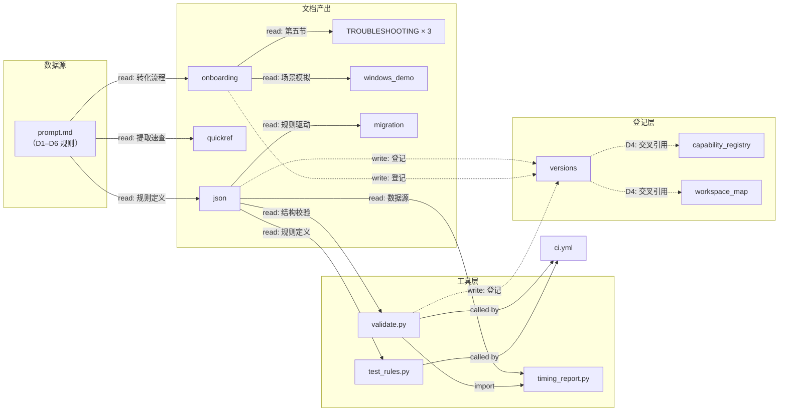

# doc_alignment 15 件套产物架构图

> 基于 doc_alignment 增强块 v0.1（★固化，2026-07-22）
> 渲染方式：复制下方 Mermaid 代码到 [Mermaid Live Editor](https://mermaid.live) 或 VS Code 的 Mermaid 预览插件。

---

## 完整依赖关系图



---

## 分层架构视图



---

## 数据流向图（读/写/引用）



---

## 产物拓扑排序（构建顺序）

```
1.  doc_alignment.prompt.md          ← 根，所有规则源头
2.  doc_alignment.json               ← 从 1 结构化导出
3.  doc_alignment_quickref.md        ← 从 1 提取速查
4.  doc_alignment_onboarding.md      ← 从 1 转化流程
5.  TROUBLESHOOTING.md               ← 从 4 第五节独立
6.  TROUBLESHOOTING_table.md         ← 从 5 表格化
7.  TROUBLESHOOTING_raw_tables.md    ← 从 5 去装饰
8.  doc_alignment_windows_demo.md    ← 从 4+5 场景模拟
9.  doc_alignment_migration_checklist.md ← 从 2 规则驱动
10. validate_doc_alignment_json.py   ← 从 2 读取校验
11. test_doc_alignment_rules.py      ← 从 2 读取规则
12. ci_timing_report.py              ← 从 10 import + 从 2 读取
13. ci_timing_report.json            ← 从 12 生成
14. .github/workflows/doc_alignment_ci.yml ← 调用 10+11
15. capability_registry.md           ← 从 1-14 登记
    versions.md                      ← 从 1-14 登记
    workspace_map.md                 ← 从 1-14 登记
```

---

> 复制上方 Mermaid 代码到 [mermaid.live](https://mermaid.live) 即可渲染交互式图表。